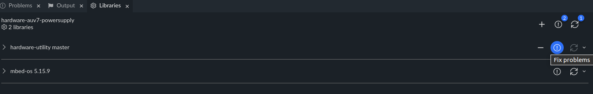
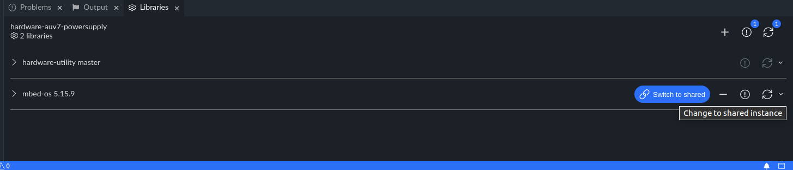
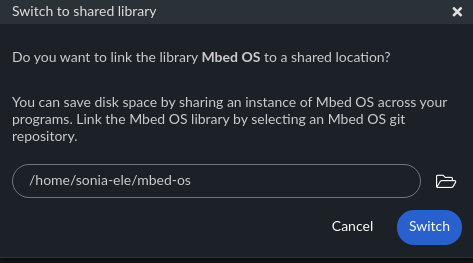

# Installation
## Prerequisite
1. If this is not already the case, install mbed studio: https://os.mbed.com/studio/
2. If this is not already done clone a local version of mbed-os 5.15.9. Put this version in a local folder:
```
git clone --branch mbed-os-5.15.9 https://github.com/ARMmbed/mbed-os.git
```

## Setup
1. Clone the current repo in a local folder
```
git clone github.com:sonia-auv/hardware-auv7-powersupply.git
```
2. Switch to the correct branch
```
git checkout mbed_studio_ina228
```
3. With Mbed studio, open the folder where you cloned your repo (not the folder of folder of the repo itself)
4. The name of the repo should be visible in the left bar, Open it
5. Click on the library tab in the bottom window
6. Next to "hardware-utility master" click to "fix problem, this will download the hardware utility library (which is not downloaded by default)

7. Next "Mbed OS 5.15.9" click on "switch to share copy" (you may have to hover your mouse over the line). This will let you point mbed studio to your local installation of mbed os

8. A dialog window will appear, use it to point mbed os to your local installation of mbed os

